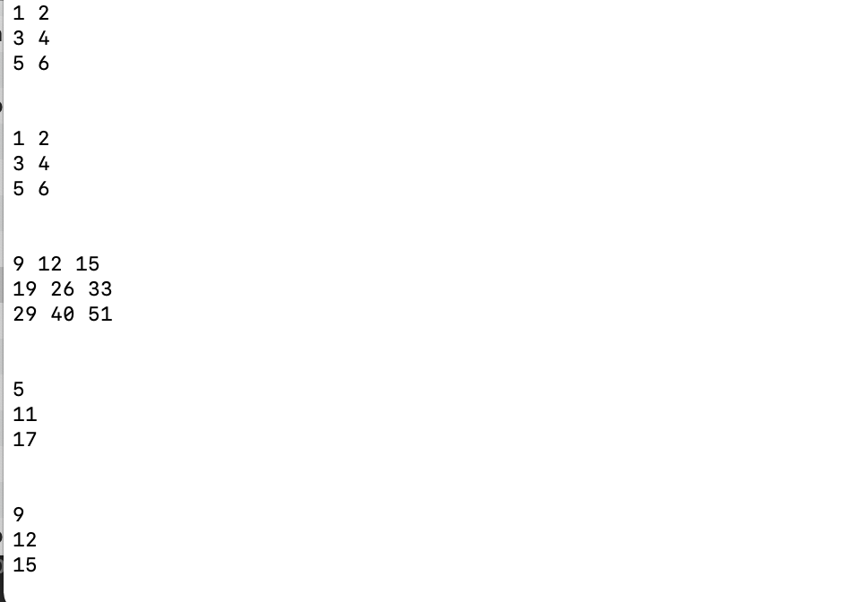
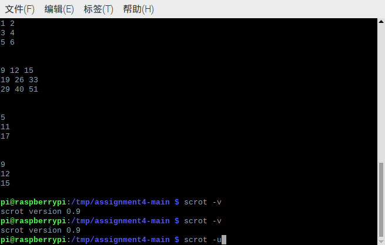

#CS205 C/ C++ Program Design - Assignment 4
***
Name: Zhang Jiayi

SID: 11610231

##Part 1 - Analysis
The problem is to declare a class Matrix in file matrix.hpp and implement its member functions and friend functions (if any) in file matrix.cpp. 

##Part 2 - Result & Verification
The class Matrix should be designed for a matrix with float elements. It should contain some members to describe its number of rows and columns, data and others. Please use private keyword to protect the data inside.

```
class Matrix{
private:
    int rows;
    int columns;
    float * data;
    
public:
    Matrix(const int r=0, const int c=0, const float * d=0);
    Matrix(const Matrix &m);
    ~Matrix();
    Matrix &operator=(const Matrix &m);
    Matrix operator*(const Matrix& other) const;
    vector<float>operator*(const vector<float>v) const;
    friend ostream & operator<<(ostream &os, const Matrix &other);
    friend vector<float>operator*(vector<float>v, const Matrix& other);
};
```
Please design some constructors, destructor, operator =, operator << and some others as what Lecture Notes in Week 11 describe.

```
Matrix & Matrix::operator=(const Matrix &m){
    if(this==&m){
        return *this;
    }
    delete [] data;
    rows=m.rows;
    columns=m.columns;
    data=new float[rows*columns];
    for(int i=0; i<rows*columns; i++){
        data[i]=m.data[i];
    }
    return *this;
}

Matrix Matrix::operator*(const Matrix & other) const{
    float * d;
    d=new float[rows*other.columns];
    for(int i=0; i<rows; i++){
        for(int j=0; j<other.columns; j++){
            d[i*rows+j]=0;
            for(int k=0; k<columns; k++){
                
                d[i*other.columns+j]+=data[i*columns+k]*other.data[k*other.columns+j];
            }
        }
    }
    return Matrix(rows, other.columns, d);
}

vector<float>Matrix::operator*(const vector<float>v) const{
    vector<float>result;
    for(int i=0; i<rows; i++){
        float r=0;
        for(int j=0; j<columns; j++){
            r+=data[i*columns+j]*v[j];
        }
        result.push_back(r);
    }
    return result;
}

vector<float>operator*(vector<float>v, const Matrix & other){
    vector<float>result;
    for(int i=0; i<other.columns; i++){
        result.push_back(0);
        for(int j=0; j<other.rows; j++){
            result[i]+=v[j]*other.data[j*other.columns+i];
        }
    }
    return result;
}

ostream & operator<<(ostream &os, const Matrix &other){
    for(int i=0; i<other.rows; i++){
        for(int j=0; j<other.columns; j++){
            os<<other.data[i*other.columns+j]<<" ";
        }
        os<<endl;
    }
    return os;
}
```
Please implement operator * overloading such that the class can support: C = A * B, C = A * b, and C = a * B

Compile and run your program on an ARM development board.

